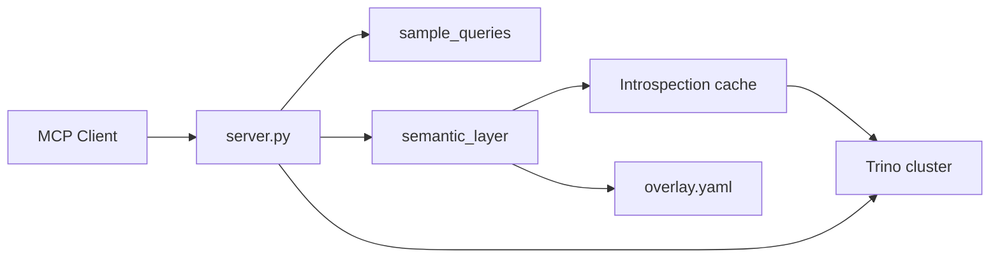

# Trino MCP Server

Natural language SQL on **any** Apache Trino or Starburst (SEP) cluster via the Model Context Protocol (MCP).

The server introspects your live Trino metadata at runtime, optionally merges a semantic **overlay** (joins, metrics, glossary), and prioritizes customer **sample queries** when configured.

## Prerequisites

- Python 3.11+
- [uv](https://docs.astral.sh/uv/)
- A reachable Trino/SEP coordinator
- An MCP client (Claude Desktop, Cursor, etc.)

## Install

```bash
cd trino-mcp
cp .env.example .env   # set TRINO_PASSWORD and optional paths
uv sync --extra dev
```

`server.py` loads variables from `.env` in this directory (via pydantic-settings). Keep `.env` out of git.

For MCP in Cursor/VS Code, either set `envFile` in `.cursor/mcp.json` / `.mcp.json` or export vars from `.env` before starting the client.

## Configure MCP client

Point at your Trino cluster. Example — **SM Prime / SEP** (matches customer CLI: `--server https://sep.smprime.sm.ph:443 --insecure --user svc_ren3`):

```json
{
  "mcpServers": {
    "trino": {
      "command": "uv",
      "args": ["run", "--directory", "/absolute/path/to/trino-mcp", "python", "server.py"],
      "env": {
        "TRINO_HOST": "sep.smprime.sm.ph",
        "TRINO_PORT": "443",
        "TRINO_SCHEME": "https",
        "TRINO_USER": "svc_ren3",
        "TRINO_PASSWORD": "your_password",
        "TRINO_AUTH": "basic",
        "TRINO_VERIFY": "false",
        "SEMANTIC_OVERLAY_PATH": "/absolute/path/to/trino-mcp/semantic/overlay.smprime.yaml"
      }
    }
  }
}
```

> Store secrets via env vars or a secret manager — not committed to git.

### Instructions vs skill (two layers)

| Layer | Location | Who reads it | Content |
|-------|----------|--------------|---------|
| **MCP server instructions** | `prompts/trino_sme.md` | Any MCP client that supports server `instructions` (Claude Desktop, Cursor, etc.) | Trino/SEP SME: quoting, federation, dialect, performance |
| **Agent skill** | [skills/trino-nl-to-sql/SKILL.md](skills/trino-nl-to-sql/SKILL.md) | Cursor agent (via [.cursor/skills/trino-nl-to-sql](.cursor/skills/trino-nl-to-sql)) | Tool call order, workflow, presentation rules |

Runtime deployment hints (sample query count, Trino host) are appended in `prompts/loader.py` at server startup.

You do **not** need to paste `trino_sme.md` into project settings if your client honors MCP server instructions.

## Project layout

```
trino-mcp/
├── server.py              # MCP entrypoint
├── config.py              # env / .env
├── trino_client.py        # Trino connection + SQL
├── sample_queries.py      # sample playbook YAML
├── semantic_layer.py      # introspection + overlay merge
├── sql_knowledge.py       # mine catalogs/joins from sample SQL
├── tools/                 # MCP tool handlers (registered from server.py)
│   ├── samples.py
│   ├── semantic_tools.py
│   └── schema_tools.py
├── prompts/trino_sme.md   # MCP server instructions (Trino SME — all clients)
├── skills/trino-nl-to-sql/SKILL.md  # Cursor skill (tool workflow only)
├── samples/               # sample_queries.yaml + xlsx
└── semantic/              # overlay.example.yaml
```

## Environment variables

| Variable | Required | Default | Description |
|---|---|---|---|
| `TRINO_HOST` | yes | — | Coordinator hostname |
| `TRINO_PORT` | | `8080` | Port |
| `TRINO_USER` | yes | — | Trino user |
| `TRINO_PASSWORD` | if `TRINO_AUTH=basic` | — | Password |
| `TRINO_AUTH` | | `basic` | `none`, `basic`, or `jwt` |
| `TRINO_SCHEME` | | `https` | `https` or `http` |
| `TRINO_VERIFY` | | `true` | `true`, `false`, or path to CA cert |
| `TRINO_MAX_ROWS` | | `100` | Max rows per `execute_query` |
| `TRINO_DEFAULT_CATALOG` | | — | Session default catalog |
| `TRINO_DEFAULT_SCHEMA` | | — | Session default schema |
| `CATALOG_DESCRIPTIONS` | | `{}` | JSON catalog → description for `list_catalogs` |
| `SEMANTIC_OVERLAY_PATH` | | — | YAML overlay (joins, metrics, glossary, aliases) |
| `INTROSPECT_CATALOGS` | | all | CSV allow-list of catalogs to introspect |
| `INTROSPECT_EXCLUDE_SCHEMAS` | | `information_schema,pg_catalog,sys` | CSV schemas to skip |

## How it works



1. **Introspection** (lazy, cached): walks `system.metadata.table_comments` when available, else `SHOW SCHEMAS` / `SHOW TABLES` / `DESCRIBE` per catalog. Per-catalog errors are logged and skipped.
2. **Overlay** (optional): relationships, metrics, glossary, `entity_aliases` — see [semantic/overlay.example.yaml](semantic/overlay.example.yaml).
3. **Sample queries**: bundled at `samples/sample_queries.yaml` (regenerate from Excel via `scripts/import_sample_queries_xlsx.py`).

Call **`refresh_schema`** to rebuild the introspection cache after DDL changes.

## MCP tools

| Tool | Purpose |
|------|---------|
| `search_sample_queries` | Match user phrase to customer playbook (**first**) |
| `get_sample_query` | Full SQL template for a sample id |
| `list_sample_queries` | Catalog of sample questions |
| `get_datasource_knowledge` | Catalogs/tables/columns/joins mined from sample SQL |
| `refresh_schema` | Re-introspect Trino |
| `list_entities` | Introspected tables as entities |
| `describe_entity` | Columns, join_hints, overlay relationships |
| `get_relationships` | Overlay join conditions |
| `list_metrics` / `get_metric_sql` | Overlay metrics |
| `resolve_term` | Glossary + name lookup |
| `list_catalogs` / `list_schemas` / `list_tables` / `describe_table` | Raw schema fallback |
| `execute_query` | Run SELECT (server-enforced) |

## Sample queries import

```bash
uv run python scripts/import_sample_queries_xlsx.py /path/to/REN3_SAMPLE_QUESTIONS_QUERIES.xlsx
```

Writes `samples/sample_queries.yaml` in the repo (loaded automatically on server start).

## Tests

```bash
uv run pytest
```

## FAQ

### How do I run the MCP server?

**One-time setup:**

```bash
cd trino-mcp
cp .env.example .env   # set TRINO_PASSWORD (and optional SEMANTIC_OVERLAY_PATH)
uv sync
```

**Smoke test** (process waits on stdin — normal for MCP stdio):

```bash
uv run python server.py
```

Press Ctrl+C to stop. If this starts without config errors, the server is fine; connect a client next.

### How do I use it in Cursor?

1. Put a real `TRINO_PASSWORD` in `trino-mcp/.env`.
2. Open the **`trino-mcp`** folder as the workspace, **or** point MCP at it from the monorepo (see below).
3. Enable the server: **Cursor Settings → MCP** → restart `trino` until it shows connected.
4. The agent skill is at [skills/trino-nl-to-sql/SKILL.md](skills/trino-nl-to-sql/SKILL.md) (Cursor also loads it via [.cursor/skills/trino-nl-to-sql](.cursor/skills/trino-nl-to-sql) when the workspace root is `trino-mcp`).

[`.cursor/mcp.json`](.cursor/mcp.json) in this directory:

```json
{
  "mcpServers": {
    "trino": {
      "command": "uv",
      "args": ["run", "--directory", "${workspaceFolder}", "python", "server.py"],
      "envFile": "${workspaceFolder}/.env"
    }
  }
}
```

`${workspaceFolder}` must be **`trino-mcp`**, not the monorepo root. If you open `The-Reentry-Foundation` instead, set `--directory` and `envFile` to absolute paths under `trino-mcp/`.

### How do I enable the SM Prime overlay?

In `.env`:

```bash
SEMANTIC_OVERLAY_PATH=semantic/overlay.smprime.yaml
```

The sample playbook ships at `samples/sample_queries.yaml` (no env var). Restart the MCP server after changing overlay or sample YAML.

### Do I need Docker?

**No for local dev.** Cursor and Claude Desktop should use `uv run` + `.env` (see above). That is the supported path.

**Optional** — if you deploy the server as a container (K8s, shared host without `uv` on the PATH). The image includes `samples/sample_queries.yaml`; mount a custom overlay if needed:

```bash
cd trino-mcp
docker build -t trino-mcp .
docker run -i --rm --env-file .env \
  -v "$(pwd)/semantic/overlay.smprime.yaml:/app/overlay.yaml" \
  trino-mcp
```

Set `SEMANTIC_OVERLAY_PATH=/app/overlay.yaml` in `.env` when using that mount. To override the playbook, mount `-v "$(pwd)/samples/sample_queries.yaml:/app/samples/sample_queries.yaml"`.

### How do I verify Trino connectivity (without MCP)?

```bash
cd trino-mcp
uv run python -c "from config import Config; import trino_client; c=Config(); print(trino_client.list_catalogs(c))"
```

If this fails, fix `.env`, VPN, or cluster access before debugging MCP.

### The MCP server shows disconnected in Cursor

- Confirm `uv` is on your PATH and `uv sync` completed in `trino-mcp/`.
- Check `.env` exists and `TRINO_PASSWORD` is set (required when `TRINO_AUTH=basic`).
- Ensure MCP `--directory` points at `trino-mcp` (see above).
- Run `uv run python server.py` manually and read the first error line in the terminal.

### Do I need to paste the Trino SME prompt into Cursor?

No, if your client supports MCP server **instructions** — those come from `prompts/trino_sme.md` at startup. The Cursor **skill** only adds tool-call order and workflow; see [Instructions vs skill](#instructions-vs-skill-two-layers).

## Security

- `execute_query` rejects non-SELECT statements before they reach Trino.
- Use a read-only Trino user in production.
- `TRINO_VERIFY=false` disables TLS cert validation (customer `--insecure`); prefer a CA path when possible.
